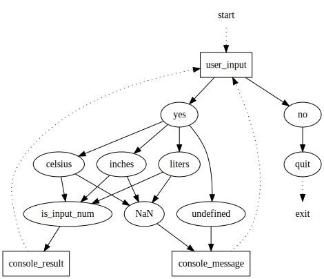

# tcc-c1-s10-multi-converter-learner-8c70de-3702
- [tcc-c1-s10-multi-converter-learner-8c70de-3702](#tcc-c1-s10-multi-converter-learner-8c70de-3702)
- [About](#about)
- [Tasks](#tasks)
- [Code](#code)
- [Overview](#overview)

# About
* A JavaScript multiconverter

# Tasks
* find at least 3 conversions formulas
* write a function for each formula
* use the `window.prompt()` function to get inputs from user 
* display the conversion results in the browser window
* the program should not quit as long as the user wants to convert values
* if the user chooses an unsupported conversion, display it in the console

# Code
* [javascript](./src/script.js)
* [graphviz](./src/graph.dot)

# Overview
