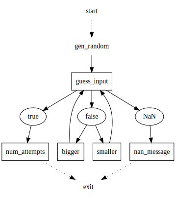

# tcc-c1-s10-number-game-learner-8c70de-3702

- [tcc-c1-s10-number-game-learner-8c70de-3702](#tcc-c1-s10-number-game-learner-8c70de-3702)
  - [About](#about)
  - [Tasks](#tasks)
  - [Code](#code)
  - [Overview](#overview)

## About
* A Guess The Number Game

## Tasks
Write the game with following rules :

* when starting the game, a secret number between 1 and 100 is generated 
* the game asks the user to enter a number
* the game will tell the user if the secret number is bigger or smaller than the guess
* as long as the user doesn't find the secret number, the game continues
* as soon as the user finds the secret number, the game stops and tells the user how many attempts it took to win
* in case the user enters antything but a number, the game should tell and quit
* try to break down these rules into smaller modules, i.e. a [chart](#overview)

## Code
* [python](./src/game.py)
* [graphviz](./src/draft.dot)

## Overview

