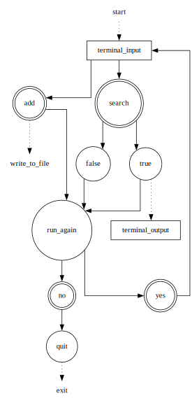

# tcc-c1-s11-note-app-learner-8c70de-3702
- [tcc-c1-s11-note-app-learner-8c70de-3702](#tcc-c1-s11-note-app-learner-8c70de-3702)
  - [About](#about)
  - [Tasks](#tasks)
  - [Code](#code)
  - [Overview](#overview)

## About
Exercise : A note taking app

## Tasks
+ Build your very own terminal-based note taking app.
+ Allow to add notes and search them.

## Code
+ [python](./src/noteapp.py)
+ [draft](./src/draft.dot)

## Overview

